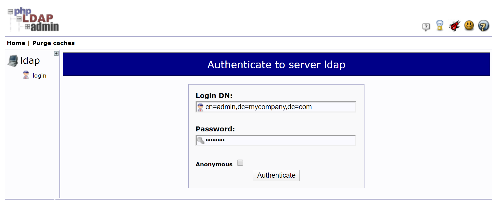
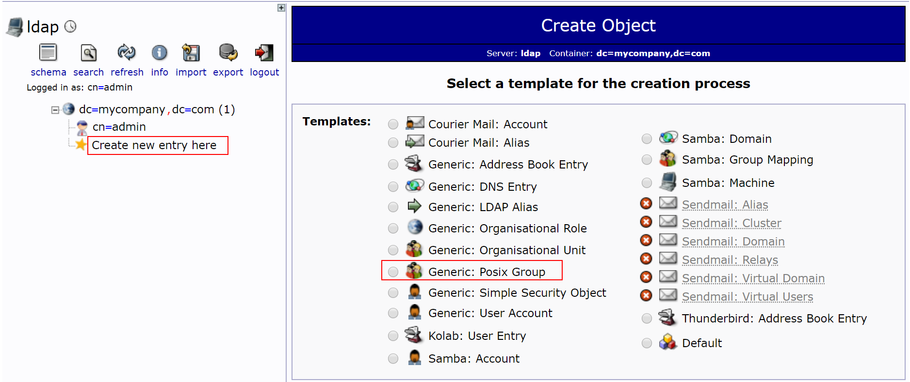
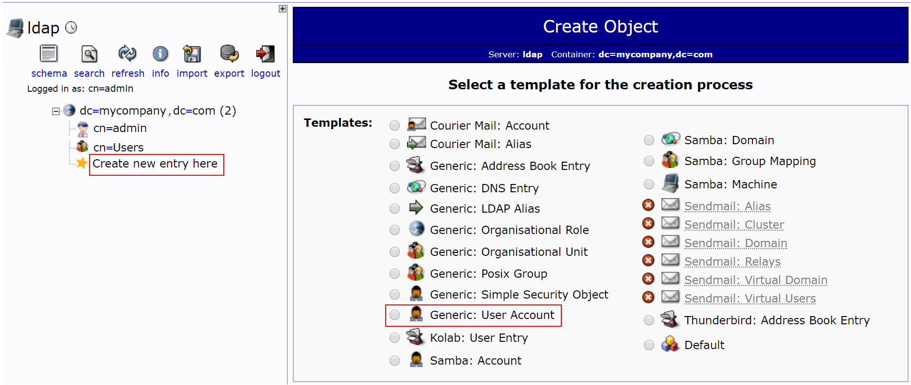
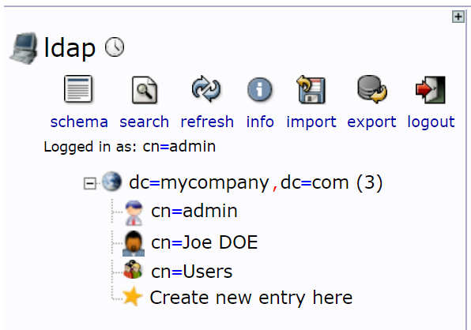

# Create your first LDAP user

1. Navigate [to `https://localhost:8081`](https://localhost:8081)

2. Click on login and provide the following details :

    DN: `cn=admin,dc=mycompany,dc=com`
    Password: `adminpwd`

    

3. Click on `Create new entry here` > `Generic: Posix Group`

    Before creating the user, we need to create a group

    Name this group `Users`

    

4. Click on `Create new entry here` > `Generic: User Account`

    

    Then, fill its details :

    - First name : Joe
    - Last name : DOE
    - User ID : jdoe
    - Password : jdoe
    - GID Number : Users

    Now, you should have this :

    

    Perfect, our user is created, [time to run the API](./README.md#run-the-api) !