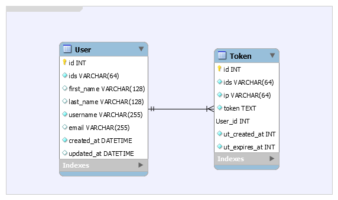

# Dockerized ReactJS, Flask & LDAP boilerplate

<p align="center">
    <a href="https://travis-ci.com/flavienbwk/reactjs-flask-ldap-boilerplate" target="_blank">
        
    </a>
    <a href="https://codebeat.co/projects/github-com-flavienbwk-reactjs-flask-ldap-boilerplate-master"></a>
</p>
<p align="center">ReactJS + Flask + Docker (+ K8S)<br/>boilerplate using a token-based LDAP authentication</p>

## Features

- Docker architecture
- LDAP authentication
- Token-based API authentication
- Automatic [token renewal](./api/app/src/service/auth_service.py#L43) with [a Flask middleware](./api/app/src/service/auth_service.py#L30)
- Swagger documentation
- Flask-Migrate
- Flask-SQLAlchemy (PostgreSQL was chosen)
- [Logging and logs rotation](./api/app/src/utils/Logger.py#L12)
- [Choose](./app/app/src/App.js#L65) between sidebar and navbar (or use both !)
- Responsive design
- [Development](./docker-compose.yml), [production](./prod.docker-compose.yml) and [Kubernetes](./k8s) builds
- State-of-the-art [Python packaging](./api/app/setup.py)

## API documentation

We've chosen Swagger to document the API. Run the API following the steps below and go to [`http://localhost:5000`](http://localhost:5000).

Here you can take a look at the database architecture scheme :

<p align="center">
    
</p>

> Reminder : there is no `password` field because we use LDAP for authentication.

## Why using LDAP authentication ?

LDAP services are used in a lot of companies and institutions around the world to manage their user accounts and rights in a central place.

With this boilerplate, you will be able to develop corporate-ready services AND avoid yourself the troubles of developing registration / password forgotten / change password / profile update code.

## Getting started (development)

This section will explain how to properly run this project and set-up the LDAP server with one user.

1. Copy the `.env.example` file to `.env`

    ```bash
    cp .env.example .env
    ```

    > This is a good practice so your `.env` can't be committed along with your modifications (is in `.gitignore`)

2. Start the authentication services

    ```bash
    docker-compose up ldap phpldapadmin database adminer -d
    ```

   - **phpLDAPAdmin** (LDAP management) will be available at `https://localhost:8081`
   - **adminer** (PostgreSQL management) will be available at `http://localhost:8082`

    **Create** your first user by accessing phpLDAPAdmin at `https://localhost:8081` and [following the LDAP user creation guide](./CREATE_LDAP_USER.md).

3. NGINX reverse-proxy

    This boilerplate includes NGINX as a reverse proxy so we can have a unique endpoint for our app and API. Else, we would have to open two endpoints : one for the app, the other for the API.

    ```bash
    docker-compose up --build -d nginx
    ```

    > NGINX will auto restart until you have started the app and API below.

4. Run the API

    The database will be automatically set-up thanks to Flask Migrate and any future modification brought to [models](./api/app/src/model) will be automatically applied when the API is **restarted**.

    You might wait some time before the database get updated after starting the API :

    ```bash
    docker-compose up --build -d api
    ```

    > For development, go to [`http://localhost:5000`](http://localhost:5000) to access the API documentation

5. Run the web app

    ```bash
    # Expect several minutes for first launch (npm install)
    docker-compose up --build -d app
    ```

    > :information_source: If you want to add a NPM package, just stop & re-launch `docker-compose up app`.

    Enjoy the app on [`http://localhost:8080`](http://localhost:8080)

## Deploy to production

1. Prepare environment configuration

    Copy `.env.example` to `.env` and **edit** the passwords, keys and credentials

    Use the provided Docker LDAP server or edit the config to use your own.

    ```bash
    cp .env.example .env
    ```

2. Build the application for production

    ```bash
    docker-compose -f prod.docker-compose.yml build
    ```

3. Start the authentication services

    ```bash
    docker-compose up ldap phpldapadmin database adminer -d
    ```

    **Create** your first user by accessing phpLDAPAdmin at `https://localhost:8081` and [following the LDAP user creation guide](./CREATE_LDAP_USER.md).

    :information_source: We recommend you to hide this service behind a firewall

4. Run the application

    ```bash
    docker-compose -f prod.docker-compose.yml up nginx api app -d
    ```

    Access the UI at `https://localhost:8080`

### Deploy to K8S

I pretend you have here your K8S instance configured to be accessed by your `kubectl` CLI.

I've used [Scaleway Kapsule](https://www.scaleway.com/en/kubernetes-kapsule) to perform my tests. This is an easy way to have a Kubernetes cluster quickly ready.

1. Building production images (optional)

    Images are tagged `flavienb/reactjs-flask-ldap-boilerplate-{api,app,nginx}:latest` by default. Edit it in `prod.docker-compose.yml` before building.

    :information_source: You might be interested in pushing your images in a private registry (e.g: [Scaleway's Container Registry service](https://www.scaleway.com/en/container-registry/)).

    ```bash
    docker-compose -f prod.docker-compose.yml build
    ```

    Finally, `docker push` the 3 images and edit K8S' configurations :

    - [k8s/app.yaml, line 31](k8s/app.yaml#L31)
    - [k8s/api.yaml, line 21](k8s/api.yaml#L21)
    - [k8s/nginx.yaml, line 21](k8s/nginx.yaml#L21)

2. Add a new `reactjs-flask-ldap-boilerplate` namespace

    ```bash
    kubectl create namespace my-app
    ```

3. Configure your Ingress app endpoint

    - **Edit** the env variables in [k8s/env-configmap.yaml](./k8s/env-configmap.yaml)
    - **Edit** the app and phpldapadmin endpoints in [k8s/ingress.yaml, line 10 and 35](./k8s/ingress.yaml#L10)
    - **Check** the PersistentVolumeClaim if you're not using Scaleway in all `*-pvc.yaml` files

    Deploy with :

    ```bash
    kubectl apply -f ./k8s
    ```

4. Configure the first user

    **Create** your first user by accessing phpLDAPAdmin at [endpoint defined](./k8s/ingress.yaml#L35) and [following the LDAP user creation guide](./CREATE_LDAP_USER.md).

:smiley: Suggestions and feedbacks are [highly appreciated](https://github.com/flavienbwk/reactjs-flask-ldap-boilerplate/issues/new)
